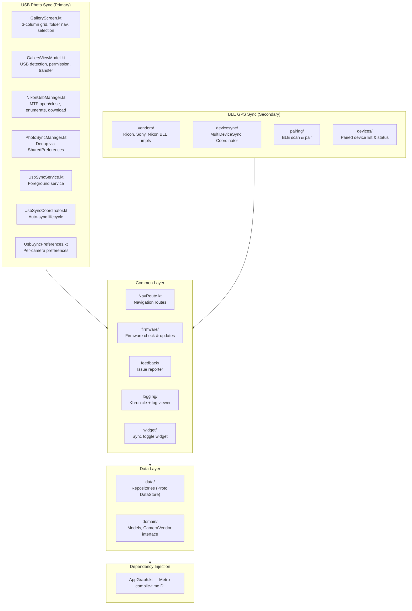

# Contributing to CameraSync

Thank you for your interest in contributing! CameraSync is an Android app that syncs photos from
Nikon cameras to your phone over a USB-C cable, using Android's built-in MTP API. It also carries
a secondary BLE GPS sync subsystem for Ricoh and Sony cameras inherited from the original project.

This guide will help you set up your development environment, understand the architecture, and
submit your first contribution.

## Table of Contents

- [Development Environment Setup](#development-environment-setup)
- [Building & Running](#building--running)
- [Project Structure](#project-structure)
- [Architecture](#architecture)
  - [USB Photo Sync (Primary)](#usb-photo-sync-primary)
  - [BLE GPS Sync (Secondary / Legacy)](#ble-gps-sync-secondary--legacy)
- [How to Add Support for a New Nikon Camera Model](#how-to-add-support-for-a-new-nikon-camera-model)
- [How to Add USB Support for Another Camera Brand](#how-to-add-usb-support-for-another-camera-brand)
- [Code Style](#code-style)
- [Testing](#testing)
- [Commit Conventions](#commit-conventions)
- [License](#license)

## Development Environment Setup

1. **Install Android Studio** — Ladybug (2024.2) or newer is recommended.
2. **JDK 11+** — Android Studio bundles a compatible JDK; ensure `JAVA_HOME` points to it (or JDK 17+).
3. **Android SDK 33+** — The project targets API 33 (Android 13). Install the SDK through Android Studio's SDK Manager.
4. **Clone the repository**:
   ```bash
   git clone https://github.com/yourusername/CameraSync.git
   cd CameraSync
   ```
5. **Open in Android Studio** — Use *File → Open* and select the `CameraSync` directory. Let Gradle sync complete.

> [!TIP]
> The project uses Gradle Kotlin DSL and a version catalog (`gradle/libs.versions.toml`).
> Dependencies are declared in `gradle/libs.versions.toml` and referenced in `build.gradle.kts` files
> with the `libs.` accessor (e.g., `libs.compose.ui`).

## Building & Running

```bash
# Full build (debug + release)
./gradlew build

# Install debug build on a connected device
./gradlew installDebug

# Run unit tests
./gradlew test

# Format code with ktfmt
./gradlew ktfmtFormat

# Build a specific variant
./gradlew assembleDebug
./gradlew bundleRelease
```

No environment variables are required beyond a configured `JAVA_HOME`.

## Project Structure



### Source Tree

```
app/src/main/kotlin/dev/sebastiano/camerasync/
├── usb/                        # USB photo sync (Nikon)
│   ├── GalleryScreen.kt        # Primary UI — grid, folders, selection bar
│   ├── GalleryViewModel.kt     # Connection state machine, transfer logic
│   ├── NikonUsbManager.kt      # MTP device operations & photo enumeration
│   ├── PhotoSyncManager.kt     # Import deduplication (SharedPreferences)
│   ├── UsbSyncService.kt       # Foreground service for background sync
│   ├── UsbSyncCoordinator.kt   # Auto-sync lifecycle & hot-plug detection
│   └── UsbSyncPreferences.kt   # Per-camera USB sync preferences
├── vendors/                    # BLE vendor implementations
│   ├── ricoh/                  # Ricoh GR series (GPS + time sync)
│   ├── sony/                   # Sony Alpha series (GPS + time sync)
│   └── nikon/                  # Nikon BLE device recognition only
├── devicesync/                 # BLE multi-device sync coordination
├── devices/                    # Paired devices list UI & ViewModel
├── pairing/                    # BLE scanning & pairing UI
├── domain/                     # Shared domain models & vendor interfaces
├── data/                       # Proto DataStore repositories
├── di/                         # Metro DI graph & ViewModel factory
├── ui/theme/                   # Material 3 theme (Color, Type, Theme)
├── firmware/                   # Firmware update checker & WorkManager
├── feedback/                   # In-app issue reporter
├── logging/                    # Khronicle log engine & log viewer
├── widget/                     # Home screen sync toggle widget
├── work/                       # WorkManager workers
├── MainActivity.kt             # Single-activity entry point
├── CameraSyncApp.kt            # Application class
├── NavRoute.kt                 # Navigation route definitions
└── *.kt                        # Permissions, BLE extensions

app/src/main/res/
├── xml/nikon_usb_device_filter.xml  # USB device filter (Nikon VID 0x04B0)
└── values/strings.xml               # Chinese UI strings
```

## Architecture

### USB Photo Sync (Primary)

The USB photo sync feature relies entirely on Android's built-in `android.mtp.MtpDevice` API —
**no protocol reverse-engineering is required**. The camera presents itself as a standard MTP/PTP
device, and Android handles the low-level USB communication.

#### USB Permission Flow

```
USB_DEVICE_ATTACHED broadcast
  → UsbManager.requestPermission(device)
  → User grants permission in system dialog
  → UsbDeviceConnection = UsbManager.openDevice(device)
  → MtpDevice.open(connection)
  → Ready for MTP operations
```

#### GalleryViewModel State Machine

The ViewModel drives the UI through a `sealed interface GalleryState`:

```
Disconnected → Connecting → Loading → Browsing (folders / photos)
                                   → Empty (no photos found)
                                   → Error (connection or enumeration failed)
Browsing → Transferring (synced=N, total=M, currentFile=name)
        → TransferDone (synced=N)
```

- **Disconnected** — No USB camera attached or permission not granted.
- **Connecting** — USB device detected, `MtpDevice.open()` in progress.
- **Loading** — MTP connection established; enumerating storages and photo handles.
- **Browsing** — Folders and/or photo groups are displayed. Users can navigate folders,
  long-press to select items, and tap "Download" to transfer.
- **Empty** — Camera connected but no photos found on storage.
- **Error** — Connection or enumeration failed. The user can retry.
- **Transferring** — `MtpDevice.importFile()` is copying photos. A `LinearProgressIndicator`
  shows progress.
- **TransferDone** — All selected photos have been saved. A count of newly imported files
  is displayed.

#### Photo Transfer Pipeline

```
MtpDevice.importFile(handle, tmpFile)
  → Read exif via ExifInterface (for date extraction)
  → Determine MIME type (image/jpeg, image/x-nikon-nef, image/heic, image/png)
  → MediaStore insert with IS_PENDING=1
  → Copy tmpFile bytes → ContentResolver output stream
  → Update MediaStore with IS_PENDING=0
  → Delete tmpFile
  → PhotoSyncManager.markAsImported(storageId, handle)
```

#### Deduplication

`PhotoSyncManager` uses `SharedPreferences` to track which MTP object handles have already been
imported. Keys are formatted as `s{storageId}_h{handle}`. Since MTP handles are session-scoped
(invalidated when the camera is disconnected/reconnected), old handles are harmless — they simply
won't match future enumerations.

#### RAW + JPEG Grouping

Nikon cameras store NEF (RAW) and JPEG pairs with the same base filename (e.g., `DSC_0001.NEF`
and `DSC_0001.JPG`). `GalleryViewModel` groups these into `PhotoGroup` entries so the UI displays
one card per capture, with a badge indicating RAW availability.

#### Background Sync

`UsbSyncService` is a short-lived foreground service that:
1. Starts on `USB_DEVICE_ATTACHED` broadcast (when `autoSyncEnabled` is true).
2. Opens MTP, enumerates all photos, downloads new ones.
3. Updates the notification with progress.
4. Stops itself after completion (with a 3-second linger so the user sees the result).

`UsbSyncCoordinator` contains the reusable sync logic. It's used by both `UsbSyncService`
(background) and can be invoked directly by the foreground UI for manual sync.

### BLE GPS Sync (Secondary / Legacy)

The BLE subsystem uses a **Strategy Pattern** to support multiple camera vendors through
a common abstraction layer. It handles GPS location and date/time synchronization over
Bluetooth Low Energy.

#### Key Components

| Component | Path | Purpose |
|---|---|---|
| `CameraVendor` | `domain/vendor/CameraVendor.kt` | Strategy interface: GATT spec, protocol, device recognition |
| `CameraVendorRegistry` | `domain/vendor/CameraVendorRegistry.kt` | Registry of all supported vendors, scan filter aggregation |
| `VendorConnectionDelegate` | `domain/vendor/VendorConnectionDelegate.kt` | Encapsulates connection/sync lifecycle per vendor |
| `MultiDeviceSyncCoordinator` | `devicesync/MultiDeviceSyncCoordinator.kt` | Core sync logic, vendor-agnostic |
| `MultiDeviceSyncService` | `devicesync/MultiDeviceSyncService.kt` | Long-running foreground service for BLE sync |

#### Supported Vendors

- **Ricoh** — `vendors/ricoh/` — GR III, GR IIIx (tested). GPS + time sync.
- **Sony** — `vendors/sony/` — Alpha series (ILCE-7M4, etc.). GPS + time sync with DD30/DD31 locking handshake.
- **Nikon** — `vendors/nikon/` — BLE advertisement recognition only. Does not perform GPS sync.
  The actual Nikon photo sync goes through USB/MTP.

## How to Add Support for a New Nikon Camera Model

Since the app uses standard MTP (Media Transfer Protocol), **most Nikon cameras should work
out of the box** without code changes. MTP is a standardized USB protocol, and Nikon cameras
present their SD card storage through it.

However, if a camera uses a different USB Vendor ID or behaves differently:

1. **Check the Vendor ID** — Run `lsusb` (on a rooted device or via ADB shell) to find the
   device's VID. All Nikon cameras use `0x04B0` (1200 decimal), but verify.
2. **Update the USB device filter** — If the VID differs, edit
   `app/src/main/res/xml/nikon_usb_device_filter.xml`:
   ```xml
   <usb-device vendor-id="1200" />
   ```
3. **Test MTP enumeration** — Connect the camera, verify that `MtpDevice.getStorageIds()`
   returns valid storage IDs, and `getObjectHandles()` returns photo handles.
4. **Test download** — Transfer a few photos and verify they appear in
   `Pictures/CameraSync/`.
5. **Update supported cameras** — Add the model to the *Supported Cameras* section in
   `README.md`.

## How to Add USB Support for Another Camera Brand

Adding support for a non-Nikon camera brand (e.g., Canon, Fujifilm) involves these steps:

### 1. Check MTP Compatibility
Most cameras support MTP or PTP. Connect the camera to a computer and verify it shows up as
an MTP device. If the camera uses a proprietary USB protocol (not MTP), this approach won't work —
you'd need to reverse-engineer the protocol or use the camera's SDK.

### 2. Create a USB Manager Class
Create a new class in `app/src/main/kotlin/dev/sebastiano/camerasync/usb/` (e.g.,
`CanonUsbManager.kt`) following the pattern of `NikonUsbManager.kt`:
```kotlin
class CanonUsbManager(private val usbManager: UsbManager) {
    fun openMtpDevice(usbDevice: UsbDevice): MtpDevice? { ... }
    fun closeMtpDevice() { ... }
    fun getCameraInfo(mtp: MtpDevice): CameraInfo? { ... }
    fun getStorages(mtp: MtpDevice): List<StorageInfo> { ... }
    fun listPhotos(mtp: MtpDevice, storageId: Int): List<PhotoInfo> { ... }
    fun downloadPhoto(mtp: MtpDevice, photo: PhotoInfo, ...): Boolean { ... }
}
```

### 3. Add USB Device Filter
Create `app/src/main/res/xml/[brand]_usb_device_filter.xml`:
```xml
<?xml version="1.0" encoding="utf-8"?>
<usb-devices>
    <usb-device vendor-id="XXXX" />
</usb-devices>
```
Register it in `AndroidManifest.xml` alongside the existing Nikon filter.

### 4. Update GalleryViewModel
Modify `GalleryViewModel` to detect the new VID and instantiate the correct USB manager.
Add a `when` branch on `UsbDevice.vendorId` to select the appropriate manager.

### 5. Update USB Sync Service
Modify `UsbSyncService` and `UsbSyncCoordinator` to support the new brand's VID and
manager class.

### 6. Add Tests
Write unit tests for the new USB manager class. Test MTP operations with mocked
`UsbManager` and `MtpDevice` instances. Integration testing requires a physical camera.

### 7. Update Documentation
Add the new brand's supported models to `README.md`.

## Code Style

- **Kotlin conventions** — Follow [Google's Kotlin Style Guide](https://developer.android.com/kotlin/style-guide).
- **ktfmt** — All code is formatted with `ktfmt` (kotlinlang style). Run `./gradlew ktfmtFormat`
  before committing.
- **Naming** — PascalCase for classes, camelCase for functions/properties, UPPER_SNAKE_CASE
  for constants.
- **Logging** — Use `com.juul.khronicle.Log` with module-level `TAG` constants. Do not use
  `android.util.Log` directly.
- **UI strings** — All user-facing strings are in Chinese (`res/values/strings.xml`). Use the
  `stringResource()` composable or `context.getString()` for text displayed in the UI.
- **Coroutines** — Inject dispatchers into ViewModels and coordinators (see AGENTS.md for the
  pattern). This makes tests deterministic with `runTest` and `UnconfinedTestDispatcher`.
- **State management** — Use `mutableStateOf` for Compose UI state, `MutableStateFlow` for
  service-level state. SnapshotStateList (`mutableStateListOf`) for reactive lists that
  trigger recomposition.

## Testing

### Unit Tests
```bash
./gradlew test                   # Run all unit tests
./gradlew test --tests "fully.qualified.TestClassName"  # Run a single test class
```

- Tests use `kotlinx.coroutines.test.runTest` with virtual time.
- Fake implementations for repositories and checkers live in `app/src/test/kotlin/`.
- `TestGraphFactory` provides fake dependencies for integration-style tests.
- Dispatchers are injected so tests can use `UnconfinedTestDispatcher`.

### Integration Testing with a Real Camera
USB MTP integration testing requires a physical Nikon camera:
1. Build and install the debug APK: `./gradlew installDebug`
2. Connect the camera via USB-C cable.
3. Verify the camera is detected and photos appear in the gallery.
4. Transfer a few photos and verify they appear in the Photos app.
5. Verify the foreground service notification appears when auto-sync is enabled.
6. Check logcat for any warnings or errors: `adb logcat | grep -E "NikonUsbManager|GalleryVM|UsbSync"`

### Test Device
Primary development and testing device: **Pixel 9** running **Android 15** with a **Nikon Z30**
camera.

## Commit Conventions

We follow [Conventional Commits](https://www.conventionalcommits.org/):

| Prefix | When to use |
|---|---|
| `feat:` | New feature (e.g., `feat: add Canon MTP support`) |
| `fix:` | Bug fix (e.g., `fix: handle empty storage in photo enumeration`) |
| `docs:` | Documentation changes |
| `refactor:` | Code restructuring without functional changes |
| `test:` | Adding or updating tests |
| `chore:` | Build, CI, dependency updates |
| `style:` | Formatting, whitespace (ktfmtFormat results) |

Keep commits **focused and atomic** — one logical change per commit. Write descriptive
commit messages with an optional body for context.

## License

CameraSync is licensed under the **Apache License 2.0**. See the [LICENSE](LICENSE) file for
the full text. By contributing, you agree that your contributions will be licensed under the
same terms.

---

*Questions? Open an issue or start a discussion on the project repository.*
