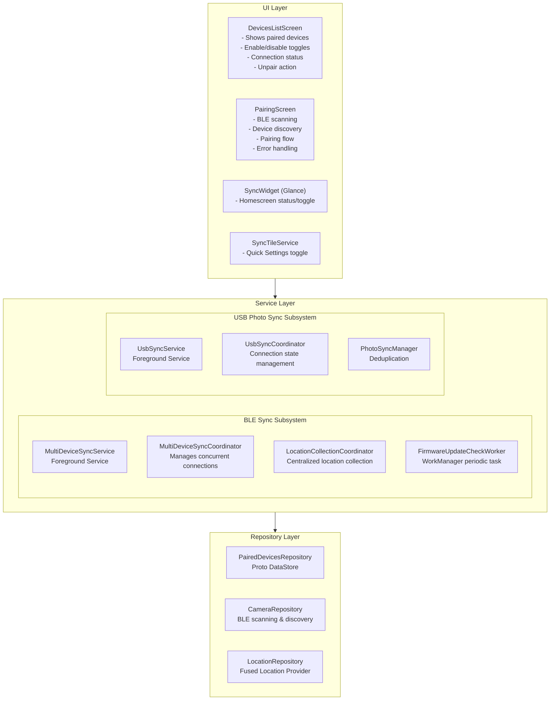
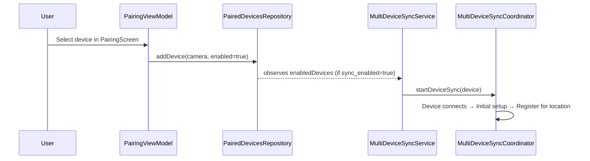
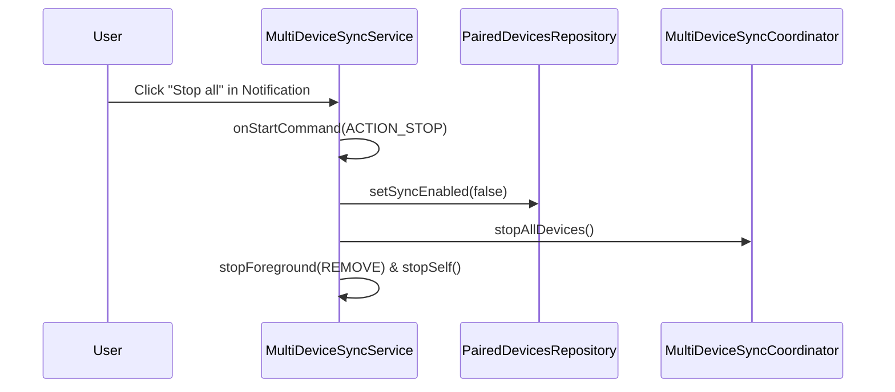
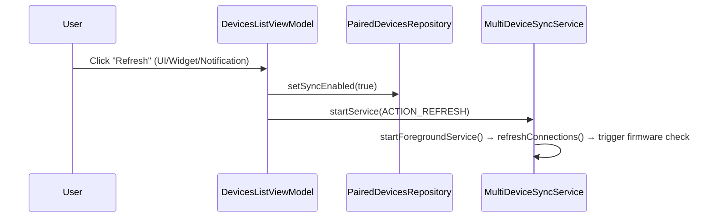
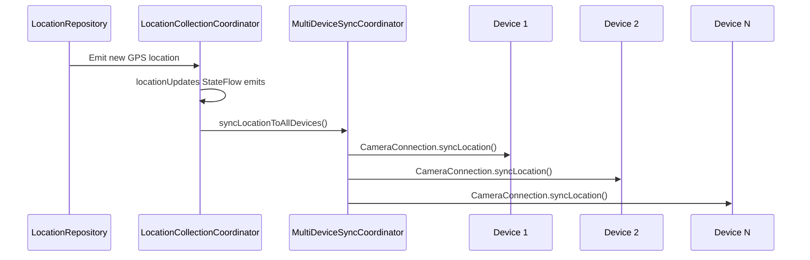
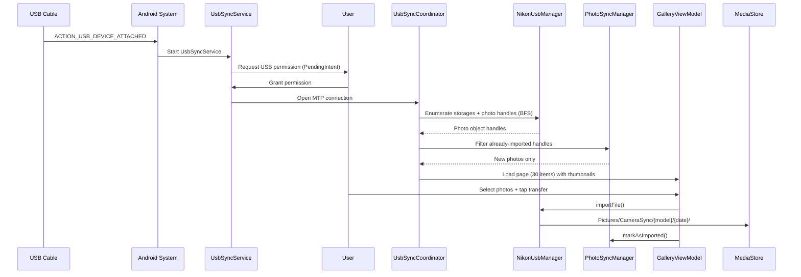
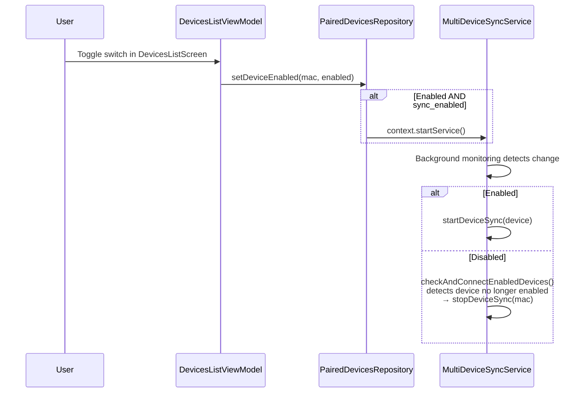

# Multi-Device Architecture

This document describes the architecture that enables CameraSync to manage multiple paired cameras
simultaneously, with centralized location collection and independent device connection lifecycle.

## Architecture Overview



## Key Components

### 1. PairedDevicesRepository

Manages the persistent storage of paired devices.

**Interface:** `domain/repository/PairedDevicesRepository.kt`

```kotlin
interface PairedDevicesRepository {
    val pairedDevices: Flow<List<PairedDevice>>
    val enabledDevices: Flow<List<PairedDevice>>
    val isSyncEnabled: Flow<Boolean>

    suspend fun addDevice(camera: Camera, enabled: Boolean = true)
    suspend fun removeDevice(macAddress: String)
    suspend fun setDeviceEnabled(macAddress: String, enabled: Boolean)
    suspend fun setSyncEnabled(enabled: Boolean)
    suspend fun isDevicePaired(macAddress: String): Boolean
    // ... more methods
}
```

**Implementation:** `DataStorePairedDevicesRepository` using Proto DataStore.

**Proto Schema:**

```protobuf
message PairedDeviceProto {
  string mac_address = 1;
  optional string name = 2;
  string vendor_id = 3;
  bool enabled = 4;
  optional int64 last_synced_at = 5;
  optional string firmware_version = 6;
  optional string latest_firmware_version = 7;
  bool firmware_update_notification_shown = 8;
  optional int64 last_firmware_checked_at = 9;
}

message PairedDevicesProto {
  repeated PairedDeviceProto devices = 1;
  optional bool sync_enabled = 2;
}
```

### 2. LocationCollectionCoordinator

Centralized location collection with automatic lifecycle management.

**Interface:** `devicesync/LocationCollector.kt`

```kotlin
interface LocationCollectionCoordinator : LocationCollector {
    fun registerDevice(deviceId: String)
    fun unregisterDevice(deviceId: String)
    fun getRegisteredDeviceCount(): Int
}
```

**Behavior:**

- Automatically starts collecting when first device registers
- Automatically stops when last device unregisters
- Exposes `StateFlow<GpsLocation?>` for consumers
- Uses `LocationRepository` (default 30-second update interval)

### 3. MultiDeviceSyncCoordinator

Core coordination logic for multiple device connections.

**Class:** `devicesync/MultiDeviceSyncCoordinator.kt`

**State Management:**

```kotlin
val deviceStates: StateFlow<Map<String, DeviceConnectionState>>
```

**Key Methods:**

```kotlin
fun startDeviceSync(device: PairedDevice)
suspend fun stopDeviceSync(macAddress: String)
suspend fun stopAllDevices()
fun isDeviceConnected(macAddress: String): Boolean
fun getConnectedDeviceCount(): Int
fun startBackgroundMonitoring(enabledDevices: Flow<List<PairedDevice>>)
fun refreshConnections()
fun startPassiveScan()
fun stopPassiveScan()
```

**Connection Lifecycle:**

1. `startDeviceSync()` establishes the BLE connection
2. **Waits for connection to be fully established** before performing initial setup (prevents GATT
   write errors)
3. Performs initial setup (firmware read, device name, date/time, geo-tagging) with connection state
   checks
4. Registers device for location updates
5. **Proactive Firmware Check**: Triggers a one-time firmware update check if data is missing or
   stale (>24h).
6. Monitors connection state and cleans up on disconnection

**Background Monitoring:**

- `startBackgroundMonitoring()` observes the enabled devices flow
- Periodically checks for enabled but disconnected devices and connects them
- **Automatically disconnects devices that are no longer enabled**
- Runs every 30 seconds and on enabled devices flow changes

**Connection States:**

```kotlin
sealed interface DeviceConnectionState {
    data object Disabled : DeviceConnectionState
    data object Disconnected : DeviceConnectionState
    data object Connecting : DeviceConnectionState
    data class Connected(val firmwareVersion: String?) : DeviceConnectionState
    data class Error(val message: String, val isRecoverable: Boolean) : DeviceConnectionState
    data class Syncing(val firmwareVersion: String?, val lastSyncInfo: LocationSyncInfo?) :
        DeviceConnectionState
}
```

### 4. MultiDeviceSyncService

Android Foreground Service managing the sync lifecycle.

**Responsibilities:**

- Runs as foreground service with location + connected device types
- Observes `PairedDevicesRepository.enabledDevices`
- Starts/stops device connections based on enabled state
- Updates notification with connection count and sync status
- Handles notification actions:
    - **Refresh**: Sets global `sync_enabled` to true, restarts service, retries all connections,
      and **triggers a one-time firmware update check**.
    - **Stop All**: Disconnects all devices, sets global `sync_enabled` to false, removes
      notification, and stops service
- **Manages Passive Scan Lifecycle**: Stops passive scan when active, and starts it when the service
  stops (if sync is still enabled).

**Lifecycle:**

1. Service starts when there are enabled devices AND global `sync_enabled` is true
2. Service stops when all devices are disabled/removed OR "Stop All" is clicked
3. Auto-reconnection only occurs when global `sync_enabled` is true
4. Manual refresh via UI or notification restarts the service regardless of current state

### 5. Auxiliary Interaction Components

#### SyncTileService

A Quick Settings Tile that allows users to toggle the global `sync_enabled` state from the
notification shade. It reflects the current sync state and triggers the `MultiDeviceSyncService`
when enabled.

#### SyncWidget (Glance)

A homescreen widget built with Jetpack Compose Glance.

- Displays the current number of connected devices.
- Provides a toggle to enable/disable global synchronization.
- Includes a manual "Refresh" button to restart the sync service.
- Uses `WidgetUpdateHelper` to ensure the UI stays in sync with the app's state.

#### FirmwareUpdateCheckWorker

A `CoroutineWorker` managed by `WorkManager` that runs periodic background checks (daily) for
firmware updates. It queries vendor-specific update endpoints and updates the
`PairedDevicesRepository` with the results, which are then shown to the user via notifications or
in-app badges. The app also proactively triggers a check when a device connects if the firmware data
is missing or older than 24 hours.

### 6. UsbSyncService (USB Photo Sync)

A Foreground Service managing USB photo transfer for Nikon series cameras (and future USB-capable cameras).

**Responsibilities:**
- Runs as foreground service with `connectedDevice` type
- Auto-starts when `ACTION_USB_DEVICE_ATTACHED` is broadcast
- Uses `CoroutineScope(Dispatchers.IO + SupervisorJob)` (same pattern as `MultiDeviceSyncService`)
- Handles intent actions: `ACTION_SYNC` (start transfer), `ACTION_STOP` (cancel and stop service)
- Exposes a `Binder` inner class for activity binding (UI status observation)
- Shows notification with transfer progress: "正在同步 (3/15)"
- Idle detection: stops service when USB cable is disconnected

**Lifecycle:**
1. USB cable plugged in → system broadcasts `ACTION_USB_DEVICE_ATTACHED`
2. Manifest-registered intent filter starts `UsbSyncService`
3. Service obtains USB permission via `PendingIntent` + `BroadcastReceiver`
4. `UsbSyncCoordinator` handles MTP connection and triggers sync
5. When USB disconnected → service stops with `stopForeground(STOP_FOREGROUND_REMOVE)`

### 7. UsbSyncCoordinator

Coordinates USB connection lifecycle and sync operations.

**Class:** `usb/UsbSyncCoordinator.kt`

**Key Responsibilities:**
- Manages `NikonUsbManager` MTP connection state
- Registers `BroadcastReceiver` for `ACTION_USB_DEVICE_ATTACHED` / `DETACHED` (hot-plug detection)
- Emits `StateFlow<UsbConnectionState>` for reactive UI updates
- Triggers `PhotoSyncManager` for deduplicated photo transfer
- Coordinates with `GalleryViewModel` for UI-driven transfer operations

**Connection States:**
```kotlin
sealed interface UsbConnectionState {
    data object Disconnected
    data object PermissionRequired
    data object Connecting
    data class Connected(val cameraInfo: UsbCameraInfo)
    data class Transferring(val progress: TransferProgress)
    data class Done(val photosTransferred: Int)
    data class Error(val message: String)
}
```

### 8. PhotoSyncManager

Tracks imported photo handles to prevent duplicate transfers across sync sessions.

**Class:** `usb/PhotoSyncManager.kt`

**Key Features:**
- Per-storage handle tracking via `SharedPreferences` (storage ID → set of object handles)
- `isAlreadyImported(handle: Int, storageId: Int): Boolean` — fast dedup check
- `markAsImported(handle: Int, storageId: Int)` — record after successful transfer
- `clearStorage(storageId: Int)` — reset tracking for a specific storage
- Persists across app restarts — handles survive process death

**Deduplication Flow:**
1. `GalleryViewModel` enumerates all object handles from MTP device
2. Each handle is checked against `PhotoSyncManager.isAlreadyImported()`
3. Previously imported photos are filtered out before transfer
4. After successful MediaStore save, handle is recorded via `markAsImported()`

## Data Flow

### Device Pairing



### Stop All Sync



### Manual Refresh / Restart



### Location Sync



### USB Photo Sync



### Hot-Plug Detection

USB attach/detach is detected reactively via a `BroadcastReceiver` registered for:
- `ACTION_USB_DEVICE_ATTACHED` — triggers `UsbSyncService` auto-start; updates device card on
  home screen to show "connected" state
- `ACTION_USB_DEVICE_DETACHED` — triggers service stop; transitions device card back to
  "disconnected"

The receiver is registered dynamically at runtime (not in the manifest) to avoid consuming
system resources when the app is not in the foreground. On Android 14+, the
`RECEIVER_EXPORTED` flag is required because the broadcast is sent by the system.

### Enable/Disable Device



**Important:** When a device is disabled, the `checkAndConnectEnabledDevices()` method automatically
detects connected devices that are no longer in the enabled list and disconnects them. This ensures
devices are properly disconnected when disabled, preventing them from remaining connected.

## Testing

### Fakes Provided

All key interfaces have fake implementations for testing:

| Interface                       | Fake Implementation           |
|---------------------------------|-------------------------------|
| `PairedDevicesRepository`       | `FakePairedDevicesRepository` |
| `LocationCollectionCoordinator` | `FakeLocationCollector`       |
| `CameraRepository`              | `FakeCameraRepository`        |
| `CameraConnection`              | `FakeCameraConnection`        |
| `LocationRepository`            | `FakeLocationRepository`      |
| `CameraVendorRegistry`          | `FakeVendorRegistry`          |
| `NotificationBuilder`           | `FakeNotificationBuilder`     |
| `IntentFactory`                 | `FakeIntentFactory`           |
| `PendingIntentFactory`    | `FakePendingIntentFactory`    |
| `WidgetUpdateHelper`            | `FakeWidgetUpdateHelper`      |

**Dependency Injection**: The project uses Metro for compile-time DI. Tests use `TestGraphFactory`
to access fake dependencies, while production code uses `AppGraph.Factory`. This allows for clean
separation between test and production implementations without requiring Robolectric or extensive
Android framework mocking.

### Test Structure

```
app/src/test/kotlin/dev/sebastiano/camerasync/
├── fakes/
│   ├── FakePairedDevicesRepository.kt
│   ├── FakeLocationCollector.kt
│   ├── FakeCameraRepository.kt
│   ├── FakeCameraConnection.kt
│   ├── FakeLocationRepository.kt
│   ├── FakeVendorRegistry.kt
│   ├── FakeNotificationBuilder.kt
│   ├── FakeIntentFactory.kt
│   ├── FakePendingIntentFactory.kt
│   └── FakeWidgetUpdateHelper.kt
├── di/
│   └── TestModule.kt (Metro test dependency graph)
├── devicesync/
│   ├── MultiDeviceSyncCoordinatorTest.kt
│   ├── MultiDeviceSyncCoordinatorFirmwareTest.kt
│   ├── DefaultLocationCollectorTest.kt
│   ├── SyncCoordinatorTest.kt
│   └── NotificationsTest.kt
└── data/repository/
    └── FakePairedDevicesRepositoryTest.kt
```

### Example Test

```kotlin
@Test
fun `multiple devices can be synced simultaneously`() = testScope.runTest {
        val connection1 = FakeCameraConnection(testDevice1.toTestCamera())
        val connection2 = FakeCameraConnection(testDevice2.toTestCamera())

        cameraRepository.connectionToReturn = connection1
        coordinator.startDeviceSync(testDevice1)
        advanceUntilIdle()

        cameraRepository.connectionToReturn = connection2
        coordinator.startDeviceSync(testDevice2)
        advanceUntilIdle()

        assertEquals(2, locationCollector.getRegisteredDeviceCount())
        assertTrue(coordinator.isDeviceConnected(testDevice1.macAddress))
        assertTrue(coordinator.isDeviceConnected(testDevice2.macAddress))
    }
```

## Error Handling

### Connection Errors

When a device fails to connect:

1. State transitions to `DeviceConnectionState.Error`
2. Error message indicates cause (pairing rejected, timeout, etc.)
3. Recoverable errors can be retried via `retryDeviceConnection()`
4. Error state is preserved (not overwritten by cleanup)

### GATT Write Errors

To prevent `ProfileServiceNotBound` and other GATT write errors:

1. **Connection establishment is verified** before performing initial setup operations
2. Connection state is checked before each write operation (device name, date/time, geo-tagging)
3. If connection is lost during setup, operations fail gracefully with warnings logged
4. The coordinator waits for `connection.isConnected` to emit `true` before calling
   `performInitialSetup()`

This ensures that BLE operations only occur when the connection is fully established and active.

### Pairing Errors

The `PairingScreen` handles three error types:

- `REJECTED`: Camera rejected pairing (user needs to enable BT pairing on camera)
- `TIMEOUT`: Connection timed out (camera not nearby or BT disabled)
- `UNKNOWN`: Unexpected error

## Notifications

The foreground service shows:

- **Title**: "Syncing with N devices" or "Searching for N devices..."
- **Content**: Last sync time or connection status
- **Actions**:
    - "Refresh" - Retry failed connections
    - "Stop all" - Disconnect all devices and stop service

## Scanning Strategy

The app uses a hybrid approach to maintain connections while preserving battery life.

### 1. Active Monitoring (Foreground Service)

- When the `MultiDeviceSyncService` is running, it performs active monitoring.
- `MultiDeviceSyncCoordinator` runs a coroutine loop every 30 seconds.
- It checks if any enabled devices are disconnected and triggers an active BLE scan/connect attempt.

### 2. Passive Scanning (PendingIntent)

To improve energy efficiency when no devices are connected:

1. **Passive Scanning**: When the Foreground Service stops but sync is still enabled, the app
   registers a system-level BLE scan via `PendingIntent`.
2. **Wake-up**: The `ScanReceiver` (a `BroadcastReceiver`) is triggered by the system when a device
   matching the vendor filters is found.
3. **Automatic Restart**: `ScanReceiver` notifies the `MultiDeviceSyncService`, which restarts to
   handle the connection.
4. **Safety Net**: A `SyncStartupReceiver` handles `BOOT_COMPLETED` and `MY_PACKAGE_REPLACED` to
   ensure synchronization resumes after a device reboot or app update.

## Future Enhancements

Potential improvements to the architecture:

1. Per-device sync intervals (some devices may need more frequent updates)
2. Device priority ordering (which device gets location first)
3. Background scanning for new devices
4. Device-specific notification actions
5. Sync history and statistics per device

---

**Note**: This architecture is designed for testability. All components communicate through
interfaces, and the use of `StateFlow` enables reactive UI updates without tight coupling.
