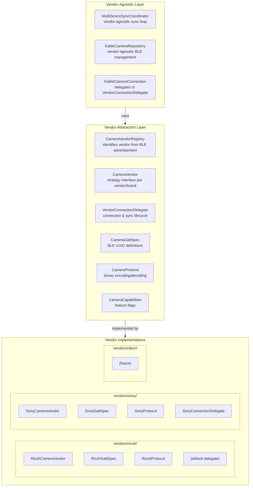
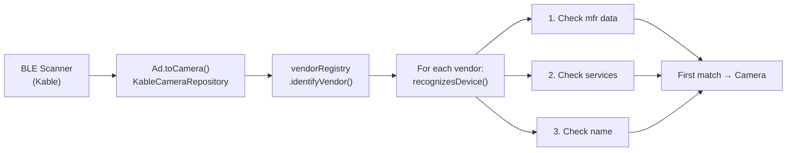
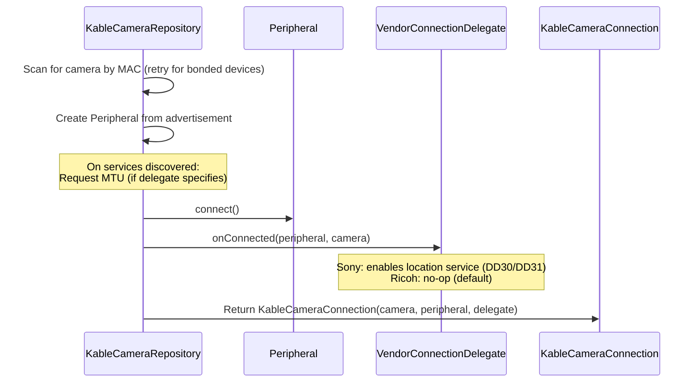
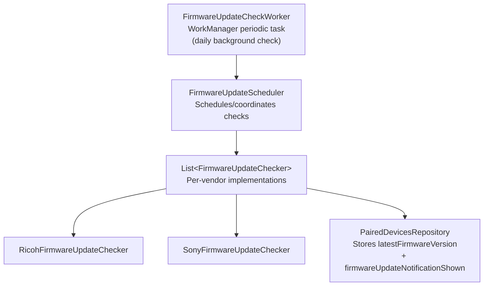

# Multi-Vendor Camera Support

This document describes the architecture that enables CameraSync to support cameras from multiple manufacturers (Ricoh, Sony), and how to extend the system for new camera brands or models.

> **Note — USB Transport**: The USB/MTP photo sync path for Nikon series cameras lives **outside** this
> BLE vendor architecture, in the `usb/` package. USB uses a fundamentally different paradigm
> (cable connection, MTP protocol, file transfer) that does not involve protocol
> reverse-engineering, BLE pairing, or GATT characteristics. The BLE vendor abstractions
> described below remain fully valid for Ricoh BLE GPS/Date-Time sync and for Sony BLE
> GPS/Date-Time sync. Nikon's `NikonCameraVendor`, `NikonGattSpec`, and `NikonProtocol`
> still exist in `vendors/nikon/` and provide BLE device recognition via advertisement
> data; however the primary Nikon data transfer path is USB.

---

## 1. Architecture Overview

CameraSync uses a **Strategy Pattern** with a clean layered design. The core sync logic is completely vendor-agnostic; all vendor-specific behavior is isolated in dedicated implementation packages.



---

## 2. Core Abstractions

### 2.1 `CameraVendor` Interface

Defined in `domain/vendor/CameraVendor.kt`. Each camera brand implements this to declare its identity, protocol, and capabilities.

| Member | Type | Purpose |
|--------|------|---------|
| `vendorId` | `String` | Unique identifier (e.g., `"ricoh"`, `"sony"`) |
| `vendorName` | `String` | Human-readable name (e.g., `"Ricoh"`) |
| `gattSpec` | `CameraGattSpec` | BLE service/characteristic UUIDs |
| `protocol` | `CameraProtocol` | Binary data encoding/decoding |
| `recognizesDevice()` | `Boolean` | Identifies whether a BLE advertisement belongs to this vendor |
| `parseAdvertisementMetadata()` | `Map` | Extracts vendor-specific metadata from manufacturer data |
| `createConnectionDelegate()` | `VendorConnectionDelegate` | Creates delegate for connection lifecycle |
| `getCapabilities()` | `CameraCapabilities` | Declares supported features |
| `extractModelFromPairingName()` | `String` | Extracts camera model from user-customized pairing name |
| `getCompanionDeviceFilters()` | `List<DeviceFilter>` | Filters for Companion Device Manager pairing |
| `getPairedDeviceName()` | `String` | Name to set on camera identifying the phone |

### 2.2 `CameraGattSpec` Interface

Defines all BLE service and characteristic UUIDs for a vendor. Each UUID field is nullable; returning `null` means "not supported" for that vendor.

```kotlin
interface CameraGattSpec {
    val scanFilterServiceUuids: List<Uuid>       // For BLE scanning
    val scanFilterDeviceNames: List<String>      // Name prefixes for scanning
    val firmwareServiceUuid: Uuid?               // Firmware version reading
    val firmwareVersionCharacteristicUuid: Uuid?
    val deviceNameServiceUuid: Uuid?             // Setting paired device name
    val deviceNameCharacteristicUuid: Uuid?
    val dateTimeServiceUuid: Uuid?               // Date/time sync
    val dateTimeCharacteristicUuid: Uuid?
    val geoTaggingCharacteristicUuid: Uuid?      // Geo-tagging toggle
    val locationServiceUuid: Uuid?               // GPS location sync
    val locationCharacteristicUuid: Uuid?
    val pairingServiceUuid: Uuid?                // Vendor-specific pairing
    val pairingCharacteristicUuid: Uuid?
    val hardwareRevisionServiceUuid: Uuid?       // Hardware revision reading
    val hardwareRevisionCharacteristicUuid: Uuid?
}
```

### 2.3 `CameraProtocol` Interface

Handles binary encoding/decoding for vendor-specific data formats.

```kotlin
interface CameraProtocol {
    fun encodeDateTime(dateTime: ZonedDateTime): ByteArray
    fun decodeDateTime(bytes: ByteArray): String
    fun encodeLocation(location: GpsLocation): ByteArray
    fun decodeLocation(bytes: ByteArray): String
    fun encodeGeoTaggingEnabled(enabled: Boolean): ByteArray
    fun decodeGeoTaggingEnabled(bytes: ByteArray): Boolean
    fun getPairingInitData(): ByteArray?         // Optional vendor pairing data
}
```

### 2.4 `CameraCapabilities` Data Class

Declares which features a vendor supports as boolean flags:

| Flag | Default | Meaning |
|------|---------|---------|
| `supportsFirmwareVersion` | `false` | Can read firmware version |
| `supportsDeviceName` | `false` | Can set paired device name |
| `supportsDateTimeSync` | `false` | Can sync date/time |
| `supportsGeoTagging` | `false` | Has geo-tagging toggle |
| `supportsLocationSync` | `false` | Can sync GPS location |
| `requiresVendorPairing` | `false` | Requires vendor-specific pairing init |
| `supportsHardwareRevision` | `false` | Can read hardware revision |

### 2.5 `VendorConnectionDelegate` Interface

Encapsulates the connection lifecycle for vendor-specific complexity. Simple vendors use `DefaultConnectionDelegate`; complex ones provide custom implementations.

```kotlin
interface VendorConnectionDelegate {
    val mtu: Int?                                  // MTU size (null = default)
    suspend fun onConnected(peripheral, camera)    // Setup after connection
    suspend fun syncLocation(peripheral, camera, location)
    suspend fun syncDateTime(peripheral, camera, dateTime)
    suspend fun onDisconnecting(peripheral)        // Cleanup before disconnect
}
```

### 2.6 `DefaultConnectionDelegate`

Standard implementation for vendors with simple GATT write flows:
1. Look up service/characteristic UUIDs from `CameraGattSpec`
2. Encode data using `CameraProtocol`
3. Write with response, 30-second timeout

### 2.7 `CameraVendorRegistry`

Manages all registered vendors. Key methods:
- `identifyVendor()` — iterates through vendors, first match wins
- `getAllScanFilterUuids()` — aggregates scan UUIDs from all vendors
- `getAllScanFilterDeviceNames()` — aggregates name prefixes from all vendors
- `getVendorById()` — look up vendor by ID string

---

## 3. Device Discovery Flow

### 3.1 BLE Scanning



### 3.2 `recognizesDevice()` Implementation

Each vendor receives three pieces of advertisement data and must return `true` if the device belongs to that brand:

**Ricoh** (`vendors/ricoh/RicohCameraVendor.kt:38-57`):
- Checks for service UUID `84A0DD62-E8AA-4D0F-91DB-819B6724C69E`
- Checks for device name prefix `"GR"` or `"RICOH"`
- Returns `true` if either matches

**Sony** (`vendors/sony/SonyCameraVendor.kt:39-65`):
- Checks manufacturer data (ID `0x012D`, device type `0x0003`)
- Checks for service UUIDs (`8000FF00-...` or `8000EE00-...`)
- Checks for device name prefix `"ILCE-"`
- Returns `true` if any matches (manufacturer data is the most reliable)

### 3.3 Manufacturer Data Parsing

Sony cameras embed protocol version information in manufacturer data:
- Bytes 0-1: Device type (little-endian)
- Byte 2: BLE protocol version

This metadata is stored in `Camera.vendorMetadata` and later used by `SonyConnectionDelegate` to determine whether DD30/DD31 locking is required (protocol version >= 65).

---

## 4. Connection & Sync Flow

### 4.1 Connection Establishment



### 4.2 Sync Operations

`KableCameraConnection` checks `CameraCapabilities` before each operation. If unsupported, throws `UnsupportedOperationException`.

**Standard operations** (implemented directly in `KableCameraConnection`):
- `readFirmwareVersion()` — read GATT characteristic, decode as string
- `readHardwareRevision()` — read standard Device Information Service
- `setPairedDeviceName()` — write device name characteristic
- `setGeoTaggingEnabled()` / `isGeoTaggingEnabled()` — read/write geo-tagging characteristic
- `initializePairing()` — write pairing init data if `requiresVendorPairing`
- `readDateTime()` — read date/time characteristic (for debugging)

**Delegated operations** (forwarded to `VendorConnectionDelegate`):
- `syncDateTime()` → `delegate.syncDateTime()`
- `syncLocation()` → `delegate.syncLocation()`
- `disconnect()` → `delegate.onDisconnecting()` then `peripheral.disconnect()`

---

## 5. Vendor Implementations in Detail

### 5.1 Ricoh

**Supported Models**: GR II, GR III, GR IIIx, GR III HDF, GR IIIx HDF, GR IV, GR IV HDF, GR IV Monochrome

**Files** (`vendors/ricoh/`):

#### RicohGattSpec (`vendors/ricoh/RicohGattSpec.kt`)

| Service | UUID | Purpose |
|---------|------|---------|
| Scan Filter | `84A0DD62-E8AA-4D0F-91DB-819B6724C69E` | BLE discovery |
| Firmware | `9A5ED1C5-74CC-4C50-B5B6-66A48E7CCFF1` | Firmware version (char: `B4EB8905`) |
| Device Name | `0F291746-0C80-4726-87A7-3C501FD3B4B6` | Paired device name (char: `FE3A32F8`) |
| Date/Time | `4B445988-CAA0-4DD3-941D-37B4F52ACA86` | Time & geo-tagging (chars: `FA46BBDD`, `A36AFDCF`) |
| Location | `84A0DD62-E8AA-4D0F-91DB-819B6724C69E` | GPS data (char: `28F59D60`) |

Scan filter device names: `"GR"`, `"RICOH"`

#### RicohProtocol (`vendors/ricoh/RicohProtocol.kt`)

**Date/Time format** (7 bytes, mixed endian):
| Bytes | Field | Byte Order |
|-------|-------|------------|
| 0-1 | Year | Little-endian short |
| 2 | Month (1-12) | — |
| 3 | Day (1-31) | — |
| 4 | Hour (0-23) | — |
| 5 | Minute (0-59) | — |
| 6 | Second (0-59) | — |

**Location format** (32 bytes):
| Bytes | Field | Type |
|-------|-------|------|
| 0-7 | Latitude | Big-endian double (raw bits) |
| 8-15 | Longitude | Big-endian double (raw bits) |
| 16-23 | Altitude | Big-endian double (raw bits) |
| 24-25 | Year | Little-endian short |
| 26 | Month | Byte |
| 27 | Day | Byte |
| 28 | Hour | Byte |
| 29 | Minute | Byte |
| 30 | Second | Byte |
| 31 | Padding | 0x00 |

**Geo-tagging format**: 1 byte — `0x00` = disabled, `0x01` = enabled

#### RicohCameraVendor (`vendors/ricoh/RicohCameraVendor.kt`)

| Feature | Value |
|---------|-------|
| Vendor ID | `"ricoh"` |
| Connection Delegate | `DefaultConnectionDelegate()` |
| Capabilities | FW version, device name, date/time, geo-tagging, location, HW revision |
| Model Extraction | Regex for GR IIIx, GR III, GR {number}, or starts with GR/RICOH |
| Paired Device Name | `"{phone_name} (CameraSync)"` |
| Companion Filters | Service UUID + name pattern `(GR\|RICOH).*` |

#### Ricoh Firmware Checker (`firmware/ricoh/RicohFirmwareUpdateChecker.kt`)

Two strategies based on model generation:
1. **Legacy models** (GR II, GR III, GR IIIx): Scraped JSON hosted on GitHub Pages
2. **Modern models** (GR IV): AWS API (`iazjp2ji87.execute-api.ap-northeast-1.amazonaws.com`)

Model detection for API: `mapModelToApiCode()` maps model names to API codes (currently only `"gr4"` for GR IV).

### 5.2 Sony

**Supported Models**: Alpha series (ILCE-7M4, ILCE-7RM5, etc.), DSC- series, ZV- series, FX series

**Files** (`vendors/sony/`):

#### SonyGattSpec (`vendors/sony/SonyGattSpec.kt`)

Sony uses a custom 128-bit UUID namespace: `8000XX00-XX00-FFFF-FFFF-FFFFFFFFFFFF` for services, and standard Bluetooth SIG base UUID `0000XX00-0000-1000-8000-00805f9b34fb` for characteristics.

**Services**:

| Service | UUID | Purpose |
|---------|------|---------|
| Remote Control (FF) | `8000FF00-FF00-FFFF-FFFF-FFFFFFFFFFFF` | Shutter, focus, zoom, scan filter |
| Location (DD) | `8000DD00-DD00-FFFF-FFFF-FFFFFFFFFFFF` | GPS sync |
| Pairing (EE) | `8000EE00-EE00-FFFF-FFFF-FFFFFFFFFFFF` | Vendor-specific pairing |
| Camera Control (CC) | `8000CC00-CC00-FFFF-FFFF-FFFFFFFFFFFF` | Date/time, firmware, model name |

**Key DD (Location) Characteristics**:

| Char | UUID | Purpose |
|------|------|---------|
| DD01 | `0000DD01-...` | Status notification (subscribe) |
| DD11 | `0000DD11-...` | Location data write |
| DD21 | `0000DD21-...` | Capability read (timezone requirement) |
| DD30 | `0000DD30-...` | Lock control (1=Lock, 0=Unlock) |
| DD31 | `0000DD31-...` | Transfer enable (1=Enable, 0=Disable) |
| DD32 | `0000DD32-...` | Time correction read |
| DD33 | `0000DD33-...` | Area adjustment read |

**Key CC (Camera Control) Characteristics**:

| Char | UUID | Purpose |
|------|------|---------|
| CC09 | `0000CC09-...` | Time completion status read |
| CC0A | `0000CC0A-...` | Firmware version (ASCII string) |
| CC0B | `0000CC0B-...` | Model name (ASCII string) |
| CC0E | `0000CC0E-...` | Date/time notification (subscribe) |
| CC12 | `0000CC12-...` | Date format setting |
| CC13 | `0000CC13-...` | **Time Area Setting** — proper date/time sync (13 bytes) |

Scan filter device names: `"ILCE-"`

#### SonyProtocol (`vendors/sony/SonyProtocol.kt`)

**Date/Time format** (CC13, 13 bytes, all Big-Endian):
| Bytes | Field |
|-------|-------|
| 0-2 | Header `0x0C 0x00 0x00` |
| 3-4 | Year (BE short) |
| 5 | Month |
| 6 | Day |
| 7 | Hour |
| 8 | Minute |
| 9 | Second |
| 10 | DST flag (0x01 = DST active) |
| 11 | Timezone offset hours (signed) |
| 12 | Timezone offset minutes |

**Location format** (DD11, 91 or 95 bytes, all Big-Endian):
| Bytes | Field |
|-------|-------|
| 0-1 | Payload length (BE short) |
| 2-4 | Header `0x08 0x02 0xFC` |
| 5 | Timezone/DST flag (0x03 = include, 0x00 = omit) |
| 6-10 | Padding |
| 11-14 | Latitude × 10,000,000 (BE int) |
| 15-18 | Longitude × 10,000,000 (BE int) |
| 19-20 | UTC Year (BE short) |
| 21-25 | Month, Day, Hour, Minute, Second |
| 26-90 | Padding (65 bytes of 0x00) |
| 91-92 | Timezone offset minutes (BE short, optional) |
| 93-94 | DST offset minutes (BE short, optional) |

Key constants:
- `COORDINATE_SCALE = 10_000_000.0`
- `PACKET_SIZE_WITHOUT_TZ = 91`
- `PACKET_SIZE_WITH_TZ = 95`

Additional protocol methods:
- `createPairingInit()` — returns `0x06 0x08 0x01 0x00 0x00 0x00 0x00`
- `createStatusNotifyEnable()` / `createStatusNotifyDisable()` — DD01 notification control
- `parseConfigRequiresTimezone()` — DD21 response parsing

#### SonyConnectionDelegate (`vendors/sony/SonyConnectionDelegate.kt`)

The most complex vendor component in the codebase. Implements a multi-step state machine:

```mermaid
flowchart TB
    subgraph onFirstEnable["onFirstEnable"]
        Check["Check bleProtocolVersion<br/>from vendorMetadata"]
        Check --> Version{"version >= 65<br/>and DD30/DD31 exist?"}
        Version -->|Yes| UnlockSeq["Requires unlock sequence"]
        Version -->|No| Subscribe["Subscribe to DD01 notifications"]
        UnlockSeq --> Lock["Write 0x01 to DD30<br/>(Lock Session)"]
        Lock --> Enable["Write 0x01 to DD31<br/>(Enable Transfer)"]
        Enable --> CapRead["Read DD21 (timezone)<br/>DD32 (time correction)<br/>DD33 (area adjustment)"]
        CapRead --> Store["Store SonyCapabilities"]
        Subscribe --> Store
    end

    subgraph syncLocation["syncLocation (every write)"]
        ReEnable["Re-enable location service<br/>(DD30→DD31) if needed"]
        ReEnable --> CheckCaps["Check capabilities<br/>for timezone inclusion"]
        CheckCaps --> Encode["Encode location packet via<br/>SonyProtocol.encodeLocationPacket()"]
        Encode --> Write["Write to DD11 with retry<br/>(3 attempts, 500ms delay)<br/>WriteType.WithResponse, 30s timeout"]
    end

    subgraph onDisconnecting["onDisconnecting"]
        Cancel["Cancel DD01 notification observation"]
        Cancel --> Disable["Write 0x00 to DD31<br/>(Disable Transfer)"]
        Disable --> Unlock["Write 0x00 to DD30<br/>(Unlock Session)"]
    end
```



MTU: 158 bytes (overridden from default).

#### SonyCameraVendor (`vendors/sony/SonyCameraVendor.kt`)

| Feature | Value |
|---------|-------|
| Vendor ID | `"sony"` |
| Connection Delegate | `SonyConnectionDelegate()` |
| Capabilities | FW version, date/time, location, vendor pairing, HW revision |
| Model Extraction | Regex for `ILCE-{model}`, or starts with ILCE/DSC- |
| Companion Filters | Remote Control service UUID + name pattern `ILCE-.*` |
| Advertisement Metadata | BLE protocol version parsed from manufacturer data |

#### Sony Firmware Checker (`firmware/sony/SonyFirmwareUpdateChecker.kt`)

Queries Sony's firmware list API at `support.d-imaging.sony.co.jp`:
- POST request with model name and current version
- Parses JSON response for `firmwareVersion`
- Version comparison uses float conversion (e.g., "2.01" vs "1.20")
- Recognizes model prefixes: `ILCE-`, `DSC-`, `ZV-`, `FX`

---

## 6. Firmware Update Infrastructure

### 6.1 Architecture



### 6.2 Interface

```kotlin
interface FirmwareUpdateChecker {
    suspend fun checkForUpdate(
        device: PairedDevice,
        currentFirmwareVersion: String?
    ): FirmwareUpdateCheckResult

    fun supportsVendor(vendorId: String): Boolean
}

sealed interface FirmwareUpdateCheckResult {
    data object NoUpdateAvailable
    data class UpdateAvailable(currentVersion, latestVersion, modelName)
    data class CheckFailed(reason: String)
}
```

### 6.3 Registration

Firmware checkers are registered as a list in `AppGraph.kt:203`:

```kotlin
fun provideFirmwareUpdateCheckers(context: Context): List<FirmwareUpdateChecker> =
    listOf(SonyFirmwareUpdateChecker(context), RicohFirmwareUpdateChecker(context))
```

### 6.4 Notification Flow

`DeviceFirmwareManager.checkAndNotifyFirmwareUpdate()` handles:
1. Check if firmware version is available
2. Look up device in `PairedDevicesRepository`
3. Check `latestFirmwareVersion` (populated by `FirmwareUpdateCheckWorker`)
4. Check if notification was already shown for this version
5. If update available and not yet notified → show system notification

---

## 7. Registration in AppGraph

All vendors must be registered in `di/AppGraph.kt` in two places:

```kotlin
// 1. Vendor Registry (for BLE scanning and connection)
@Provides
@SingleIn(AppGraph::class)
fun provideVendorRegistry(): CameraVendorRegistry =
    DefaultCameraVendorRegistry(
        vendors = listOf(
            RicohCameraVendor,
            SonyCameraVendor,
            // Add new vendors here
        )
    )

// 2. Firmware Checkers (for update notifications)
@Provides
@SingleIn(AppGraph::class)
fun provideFirmwareUpdateCheckers(context: Context): List<FirmwareUpdateChecker> =
    listOf(
        SonyFirmwareUpdateChecker(context),
        RicohFirmwareUpdateChecker(context),
        // Add new firmware checkers here
    )
```

---

## 8. How to Add a New Camera Vendor

### Step-by-Step Guide

#### Step 1: Create Vendor Package
Create `app/src/main/kotlin/dev/sebastiano/camerasync/vendors/[vendor]/`

#### Step 2: Implement `[Vendor]GattSpec`
- Define all service and characteristic UUIDs
- Return `null` for unsupported features
- Set `scanFilterServiceUuids` and `scanFilterDeviceNames` for device discovery

#### Step 3: Implement `[Vendor]Protocol`
- Implement `encodeDateTime()` / `decodeDateTime()` with the vendor's binary format
- Implement `encodeLocation()` / `decodeLocation()` with the vendor's binary format
- Implement `encodeGeoTaggingEnabled()` / `decodeGeoTaggingEnabled()` (or return empty/no-op)
- Optionally implement `getPairingInitData()` if vendor-specific pairing is needed

#### Step 4: Implement `[Vendor]ConnectionDelegate`
Two options:
- **Simple**: Use `DefaultConnectionDelegate` if the camera uses standard GATT writes (like Ricoh)
- **Complex**: Extend `DefaultConnectionDelegate` or implement `VendorConnectionDelegate` directly if the camera requires:
  - Specific MTU negotiation
  - Handshake/pairing sequences
  - Lock/unlock flows
  - Retry logic with delays
  - Capability reading before writes
  - Cleanup on disconnect (like Sony)

#### Step 5: Implement `[Vendor]CameraVendor`
Implement the `CameraVendor` interface (typically as a Kotlin `object` for singleton):
- Set `vendorId` and `vendorName`
- Return your `gattSpec`, `protocol`, and connection delegate
- Implement `recognizesDevice()` with at least one reliable identification method
- Set `getCapabilities()` with accurate feature flags
- Implement `extractModelFromPairingName()` for model detection from pairing names
- Optionally implement `getCompanionDeviceFilters()` for OS-level pairing
- Optionally implement `getPairedDeviceName()` for custom phone naming

#### Step 6: Implement `[Vendor]FirmwareUpdateChecker` (Optional)
Create in `firmware/[vendor]/`:
- Implement `checkForUpdate()` with the vendor's firmware API
- Implement `supportsVendor()` returning `true` for the vendor ID
- Handle network errors gracefully, returning `CheckFailed`

#### Step 7: Register in `AppGraph.kt`
- Add vendor to `provideVendorRegistry()`
- Add firmware checker to `provideFirmwareUpdateCheckers()` (if implemented)

#### Step 8: Write Tests
Create test files under `app/src/test/`:
- `[Vendor]CameraVendorTest.kt` — device recognition, model extraction, capabilities
- `[Vendor]GattSpecTest.kt` — UUID validation
- `[Vendor]ProtocolTest.kt` — encode/decode round-trip tests
- `[Vendor]ConnectionDelegateTest.kt` — connection lifecycle (if custom delegate)
- `[Vendor]FirmwareUpdateCheckerTest.kt` — firmware API parsing

#### Step 9: Format & Build
```bash
./gradlew ktfmtFormat
./gradlew test
./gradlew build
```

---

## 9. How Recognition Works: Model-Level Detail

### Device Identification Methods (in order of reliability)

| Method | Ricoh | Sony |
|--------|-------|------|
| Manufacturer data (BLE advertisement) | Not used | ✅ Most reliable — mfr ID `0x012D`, device type `0x0003` |
| Service UUIDs (scan filter match) | ✅ `84A0DD62-...` | ✅ `8000FF00-...` or `8000EE00-...` |
| Device name prefix (advertised name) | ✅ `"GR"`, `"RICOH"` | ✅ `"ILCE-"` |

### Model Extraction

Model extraction from pairing names is important because users can rename their cameras. Each vendor implements `extractModelFromPairingName()` to identify the actual model:

**Ricoh**:
- Check for "GR IIIx" substring → returns `"GR IIIx"`
- Check for "GR III" (but not "GR IIIx") → returns `"GR III"`
- Check for regex `GR\\s+(\\d+[a-z]?)` → returns `"GR {number}"`
- Fallback: if name starts with "GR" or "RICOH", return as-is

**Sony**:
- Check for regex `ILCE-?([0-9A-Z]+)` → returns `"ILCE-{model}"`
- Fallback: if name starts with "ILCE" or "DSC-", return as-is

---

## 10. Adding a New Camera Model Within an Existing Vendor

If the new model uses the same protocol as an existing vendor, no code changes are needed — the existing vendor's `recognizesDevice()` and `extractModelFromPairingName()` should handle it if the advertisement data matches.

### When changes ARE needed:

1. **New device name prefix** → add to `scanFilterDeviceNames` in `[Vendor]GattSpec`
2. **New service UUID** → add to `scanFilterServiceUuids`
3. **New model pattern** → update `extractModelFromPairingName()` regex
4. **Capability differences** → update `getCapabilities()` (or use per-model capability logic)
5. **Different firmware API** → update `[Vendor]FirmwareUpdateChecker`

### Example: Adding GR IV Monochrome to Ricoh

The GR IV Monochrome uses the same BLE protocol as other Ricoh cameras. It would be recognized by:
- Service UUID match (same `84A0DD62-...`)
- Name prefix match ("GR" or "RICOH")

Model extraction would detect "Monochrome" in the pairing name. The firmware checker's `mapModelToApiCode()` would need to add a mapping for the monochrome model.

---

## 11. Testing Infrastructure

### Test Fakes

Located in `app/src/test/kotlin/dev/sebastiano/camerasync/fakes/`:

**`FakeVendorRegistry`**: Mutable registry for integration testing.
- `addVendor(vendor)` — add a custom test vendor
- `clearVendors()` — reset to empty state

**`FakeCameraVendor`**: Complete fake implementation of `CameraVendor` with:
- `vendorId = "fake"`
- Recognizes devices by name containing "Fake" or specific test UUID
- All capabilities enabled
- Uses `DefaultConnectionDelegate`
- Simple model extraction (strips trailing numbers from "My Camera 1")

**`FakeGattSpec`** / **`FakeProtocol`**: Minimal implementations using a single test UUID.

### Test Patterns

1. **Vendor recognition tests**: Create `CameraVendorRegistryTest` instances with specific vendor lists, call `identifyVendor()` with various advertisement data combinations
2. **Protocol round-trip tests**: Encode data, then decode, verify the result
3. **Connection delegate tests**: Use mock `Peripheral` to simulate BLE interactions
4. **Firmware checker tests**: Mock HTTP responses, verify version comparison logic

### Running Tests
```bash
./gradlew test                                    # All tests
./gradlew test --tests "*VendorRegistryTest"      # Specific test class
./gradlew test --tests "*Sony*"                   # All Sony tests
```

---

## 12. Directory Reference

```
app/src/main/kotlin/dev/sebastiano/camerasync/
├── domain/
│   ├── model/Camera.kt                       # Domain model with vendor property
│   └── vendor/
│       ├── CameraVendor.kt                   # Strategy interface + GattSpec/Protocol/Capabilities
│       ├── CameraVendorRegistry.kt           # Vendor registry + DefaultCameraVendorRegistry
│       ├── VendorConnectionDelegate.kt       # Connection lifecycle abstraction
│       └── DefaultConnectionDelegate.kt      # Standard GATT write implementation
├── vendors/
│   ├── ricoh/
│   │   ├── RicohCameraVendor.kt              # Ricoh vendor implementation
│   │   ├── RicohGattSpec.kt                  # Ricoh BLE UUIDs
│   │   └── RicohProtocol.kt                  # Ricoh binary protocol
│   └── sony/
│       ├── SonyCameraVendor.kt               # Sony vendor implementation
│       ├── SonyGattSpec.kt                   # Sony BLE UUIDs
│       ├── SonyProtocol.kt                   # Sony binary protocol
│       └── SonyConnectionDelegate.kt         # Sony connection state machine
├── data/repository/
│   └── KableCameraRepository.kt             # Vendor-agnostic BLE repo + KableCameraConnection
├── firmware/
│   ├── FirmwareUpdateChecker.kt              # Firmware checker interface
│   ├── FirmwareUpdateCheckWorker.kt          # WorkManager periodic task
│   ├── FirmwareUpdateScheduler.kt            # Check scheduling
│   ├── ricoh/RicohFirmwareUpdateChecker.kt   # Ricoh firmware API client
│   └── sony/SonyFirmwareUpdateChecker.kt     # Sony firmware API client
└── di/
    └── AppGraph.kt                           # Vendor registration + dependency injection

app/src/test/kotlin/dev/sebastiano/camerasync/
├── domain/vendor/
│   ├── CameraVendorRegistryTest.kt
│   └── DefaultConnectionDelegateTest.kt
├── vendors/ricoh/
│   ├── RicohCameraVendorTest.kt
│   ├── RicohGattSpecTest.kt
│   └── RicohProtocolTest.kt
├── vendors/sony/
│   ├── SonyCameraVendorTest.kt
│   ├── SonyGattSpecTest.kt
│   ├── SonyProtocolTest.kt
│   └── SonyConnectionDelegateTest.kt
├── firmware/
│   ├── SonyFirmwareUpdateCheckerTest.kt
│   └── ricoh/RicohFirmwareUpdateCheckerTest.kt
└── fakes/
    └── FakeVendorRegistry.kt                  # FakeCameraVendor + FakeGattSpec + FakeProtocol
```

---

## 13. USB as a Parallel Transport (Nikon series)

### 13.1 Architecture Compared

While the BLE vendor system (Sections 1–12) handles GPS location and date/time sync via GATT
characteristics, the USB/MTP subsystem handles **photo transfer** via a completely different
paradigm:

| Dimension | BLE Vendor Architecture | USB/MTP (Nikon series) |
|-----------|------------------------|---------------------|
| **Transport** | Bluetooth Low Energy | USB Host (C2C cable) |
| **Discovery** | BLE scan + advertisement parsing | USB device attached broadcast |
| **Pairing/Auth** | Companion Device Manager, GATT pairing | Physical cable = trusted (no auth) |
| **Protocol** | Vendor-specific binary GATT writes | MTP (`android.mtp.MtpDevice`) |
| **Data** | GPS coordinates, date/time | JPEG/NEF photo files |
| **Service** | `MultiDeviceSyncService` (BLE foreground) | `UsbSyncService` (USB foreground) |
| **UI** | `DevicesListScreen` (paired device cards) | `GalleryScreen` (photo grid browser) |
| **Package** | `vendors/*/`, `data/repository/` | `usb/` |

*Table: BLE Vendor Architecture vs USB/MTP (Nikon series)*

### 13.2 USB Subsystem Files

```
usb/
├── NikonUsbManager.kt       # MTP open/close, storage enumeration, recursive listing, download
├── GalleryViewModel.kt      # Pagination, transfer state, dedup, RAW+JPEG grouping
├── GalleryScreen.kt         # Primary UI: 3-column grid, long-press selection, folder browsing
├── PhotoSyncManager.kt      # Per-storage photo handle tracking for deduplication
├── UsbSyncService.kt        # Foreground service (auto-start on USB attach, background sync)
├── UsbSyncCoordinator.kt    # Service coordination (connection state, sync triggers)
└── UsbSyncPreferences.kt    # Per-camera settings (auto-sync, format preference, last-synced)
```

### 13.3 Key Architectural Differences

1. **No protocol reverse-engineering**: MTP is a standard protocol — `MtpDevice.getObjectHandles()`,
   `getThumbnail()`, `importFile()` work out of the box. No binary packet formats to decode.

2. **No pairing flow**: USB permission is a one-time grant via Android's `PendingIntent` +
   `BroadcastReceiver` pattern. The cable provides both power and trust.

3. **Separate foreground service**: `UsbSyncService` runs independently from
   `MultiDeviceSyncService`. A user could theoretically sync GPS over BLE from a Ricoh camera
   while simultaneously importing photos over USB from a Nikon series camera.

4. **Deduplication at file level**: `PhotoSyncManager` tracks imported `objectHandle` values
   in `SharedPreferences`, avoiding duplicate imports across sessions.

5. **Hot-plug detection**: USB attach/detach is detected via `BroadcastReceiver` with
   `ACTION_USB_DEVICE_ATTACHED` / `ACTION_USB_DEVICE_DETACHED` intent filters. This powers
   the reactive device card on the home screen.

### 13.4 Nikon BLE Bridging

Nikon's BLE vendor components (`NikonCameraVendor`, `NikonGattSpec`, `NikonProtocol`) remain
in `vendors/nikon/` for BLE device recognition via advertisement data. The mfr ID `0x0399`,
device name prefix `Z_`, and SnapBridge service UUID `0000DE00-…` allow `CameraVendorRegistry`
to identify Nikon cameras during BLE scans. This enables the USB device card to display the
correct model name ("Nikon Z30") on the home screen before USB is even connected.

However, **BLE GPS/date-time sync for Nikon is blocked** — Nikon's SnapBridge authentication
layer prevents third-party GATT writes. See `TODO.md` Phase 5 for status.
