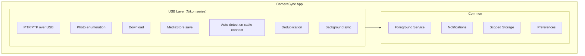

# Nikon Camera Support — USB Photo Sync

> **Status**: ✅ Working (2026-05-06)

USB wired MTP photo sync for Nikon series cameras. Transfers photos over a USB cable using Android's native `android.mtp.MtpDevice` API — no proprietary protocols, no pairing, no auth.

## Architecture

## Document Index

| Document | Scope |
|----------|--------|
| **[USB_SYNC.md](USB_SYNC.md)** | USB wired photo sync — permission flow, MTP enumeration, photo download, API quirks, architecture, key files. The definitive technical reference. |

## Quick Reference: Nikon USB

| Property | Value |
|----------|-------|
| USB Vendor ID | `0x04B0` (Nikon Corporation) |
| Android API | `android.mtp.MtpDevice` (API 24+) |
| Connection | `UsbManager.openDevice()` → `MtpDevice.open(UsbDeviceConnection)` |
| Photo enumeration | BFS folder traversal (NOT recursive by default) |
| Download | `MtpDevice.importFile()` to temp → copy to `MediaStore` |
| Storage path | `Pictures/CameraSync/{camera model}/YYYY-MM-DD/` |

## Key Features

- **Auto-detect on cable connect** — USB device filter triggers app on Z30 attach
- **Gallery browsing** — 3-column photo grid with thumbnail generation
- **Folder navigation** — browse by date folders on the camera's SD card
- **RAW+JPEG grouping** — pairs NEF/JPG taken in the same capture
- **Selective transfer** — long-press to choose which photos to download
- **Background sync** — foreground service with notification progress
- **Deduplication** — SharedPreferences-based, skips already-transferred photos

## Source Files

| File | Role |
|------|------|
| `usb/NikonUsbManager.kt` | All MTP operations: open/close, camera info, storage enum, BFS photo listing, folder listing, download |
| `usb/GalleryViewModel.kt` | USB detection, permission flow, connection, folder navigation, selection, transfer, MediaStore save |
| `usb/GalleryScreen.kt` | Primary UI: 3-column grid, folder browsing, long-press selection, transfer progress |
| `usb/PhotoSyncManager.kt` | Deduplication via SharedPreferences |
| `usb/UsbSyncService.kt` | Foreground service for background sync |
| `usb/UsbSyncCoordinator.kt` | Auto-sync lifecycle |
| `usb/UsbSyncPreferences.kt` | Per-camera USB sync preferences |
